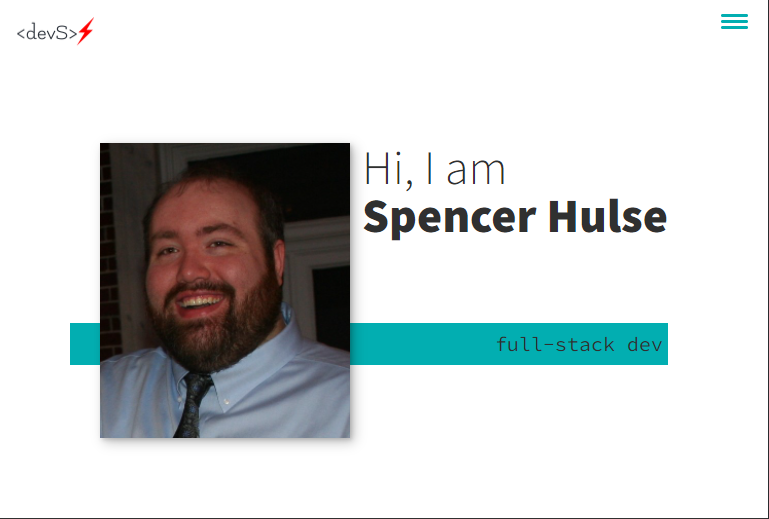

# Portfolio v2

## Description

This is my current portfolio, which has been updated to a full-stack website that utilizes CRUD api routes and mysql2 and sequelize. Those combine with handlebars.js to give me a dynamic site that automatically updates when I add or remove projects from the database.

The homepage gives information about me, and it shows images of each of my projects. There are also some brief introductions when you hover over the images, such as the type of project and main technologies used. If you click a project, you are taken to a single-project page that gives a few more details of the project, along with links to the deployed version and the GitHub repo.

Each page has a header and footer. The header includes links to the different sections of the homepage. The footer contains contact information and links to my social media and GitHub.

The deployed site can be found on [Heroku](https://enigmatic-basin-48114.herokuapp.com/)

## Usage

There is a menu for easy navigation, and each project links to more information about it. Feel free to explore.

## Contributing

No contributions at this time, please.

## Questions

If you wish to view more of my work, feel free to visit my GitHub account. Additionally, if you have any questions, you can contact me at the email address below. Thanks!

[GitHub](https://github.com/SpencerHulse)

<hulse.spencer@gmail.com>
